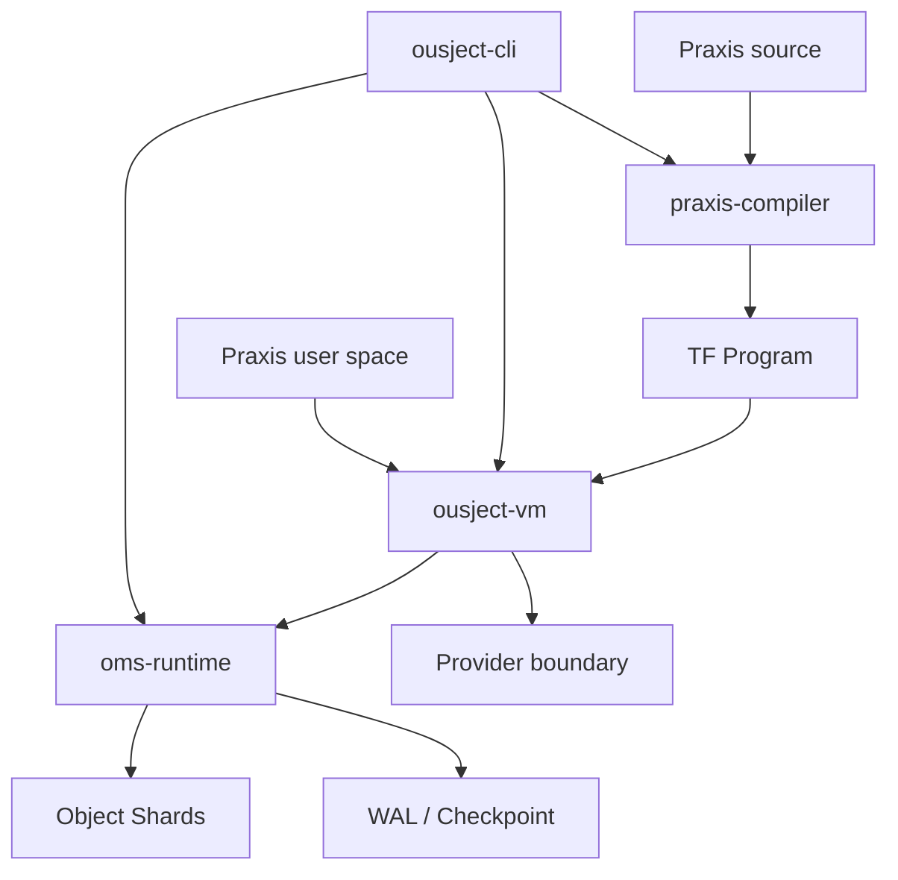

# Ousject

Ousject 是一个实验性的持久对象系统核心。它用统一的 Object 模型描述数据、程序、
Process、用户、设备和系统服务，并尝试让对象状态与 Process 执行进度在同一事务中提交。

项目当前版本是 `0.0.0`。它可以作为宿主操作系统上的 Rust 程序运行，但还不是可独立
启动的操作系统，也不提供稳定兼容承诺。

## 当前包含什么

- Object Management System（OMS）：稳定身份、类型、父子关系、命名 Link、权限、
  生命周期和事务。
- 持久化：校验 WAL、Checkpoint、恢复、Store 独占和多 Shard 原子提交。
- Praxis：面向 Object 的语言、编译器和交互式执行环境。
- Token Format（TF）：Praxis 编译结果的预发布字节码格式。
- Virtual Machine：持久 Program/Process、协作式调度、等待、Timer、IPC 和 Effect。
- 用户空间：初始化、登录、Shell 和系统管理程序。
- 宿主适配：Terminal、网络、显示、键盘和块存储 Provider。

已实现范围、证据和限制见[当前状态](docs/project/status.md)。

## 快速体验

项目固定使用 Rust `1.85.0`，并需要 `rustfmt` 与 `clippy`。在仓库根目录运行：

```bash
./scripts/ousject run examples/hello.px --memory --local
```

输出前四行应为：

```text
Ousject running
Ousject running
Ousject running
3
```

随后 CLI 会打印本次 Process 的 ID、最终状态和执行步数。

再运行一个包含对象创建、查询、更新和 Link 的例子：

```bash
./scripts/ousject run examples/objects.px --memory --local
```

`--memory` 使用非持久 Store；`--local` 明确使用本机最高权限身份，仅适合开发和恢复。
普通持久命令要求通过 `--session <token>` 提供已认证会话。

在交互终端中运行贪吃蛇（按方向键或 WASD 开始/移动，`q` 退出）：

```bash
./target/release/ousject run examples/snake.px --memory --local
```

完整步骤见[快速开始](docs/getting-started/quickstart.md)。

## 验证仓库

一键编译 Release 版 CLI：

```bash
./scripts/build
```

产物位于 `target/release/ousject`。

运行完整验收：

```bash
./scripts/check-m1
./scripts/check-system
```

`check-m1` 验证 OMS；`check-system` 另外验证 Praxis、VM、CLI、对象 API、系统安装和登录。
构建环境与单项命令见[构建与测试](docs/getting-started/build-and-test.md)。

## 架构概览



Workspace 各 crate 的职责和依赖见[系统架构](docs/concepts/architecture.md)。

## 文档入口

- [文档导航](docs/README.md)
- [快速开始](docs/getting-started/quickstart.md)
- [构建与测试](docs/getting-started/build-and-test.md)
- [系统架构](docs/concepts/architecture.md)
- [对象模型](docs/concepts/object-model.md)
- [Praxis（`.px`）语法参考](docs/reference/praxis-syntax.md)
- [Praxis API 总表](docs/reference/praxis-api.md)
- [事务、持久化与恢复](docs/concepts/durability.md)
- [当前状态](docs/project/status.md)

## 仓库布局

```text
crates/      Rust workspace crates
examples/    可直接运行的 Praxis 示例
scripts/     构建、运行和验收入口
system/      Praxis 用户空间程序
docs/        当前文档
```

文档以源码、测试和验收脚本为事实源。尚未实现的设计不会混入当前功能说明；历史方案仍可
通过 Git 历史查阅。
