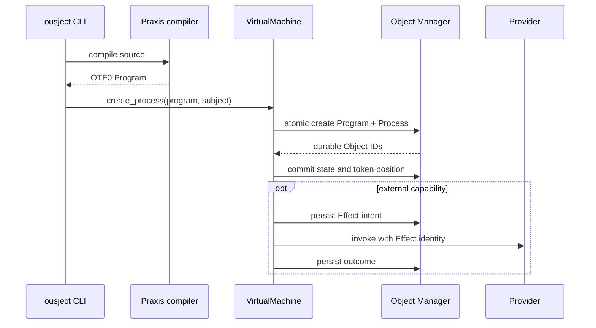

# 系统架构

Ousject 当前是运行在宿主操作系统上的 Rust Workspace。Praxis 程序不会直接操作宿主文件
或系统调用，而是通过 VM 暴露的 Object 与 Provider 边界访问系统服务。

## 分层视图

```mermaid
flowchart TB
    subgraph User[Praxis 用户空间]
        Init[init / login / shell]
        App[应用与示例]
    end

    subgraph Language[语言与执行]
        Compiler[praxis-compiler]
        Format[tf-format]
        VM[ousject-vm]
    end

    subgraph Kernel[对象系统核心]
        Runtime[oms-runtime]
        Shard[oms-shard]
        Types[oms-types]
        Auth[ousject-auth]
        Provider[ousject-provider]
    end

    subgraph Host[宿主边界]
        CLI[ousject-cli]
        Terminal[Terminal stream]
        Devices[Keyboard / Network / Storage]
        Display[Physical Display driver (not implemented)]
        Network[Resolver / TCP]
        Storage[FileSnapshotBackend]
    end

    User --> VM
    Compiler --> Format
    Format --> VM
    VM --> Runtime
    VM --> Auth
    VM --> Provider
    Runtime --> Shard
    Runtime --> Types
    Provider --> Terminal
    Provider --> Devices
    Provider -. optional future driver .-> Display
    Provider --> Network
    Runtime --> Storage
    CLI --> Compiler
    CLI --> VM
```

## Workspace crate

| Crate | 当前职责 |
|---|---|
| `oms-types` | Object/Type/Subject ID、Value、Object header、Capability、错误类型 |
| `oms-shard` | Object ID 到固定 Shard 的稳定路由 |
| `oms-runtime` | Object Store、事务、权限、索引、持久化、恢复、回收 |
| `oms-tools` | OMS 演示和开发工具 |
| `tf-format` | OTF0 Program 与 Token 的编码、解码和校验 |
| `praxis-compiler` | Praxis lexer、parser、Module 加载和 TF 生成 |
| `ousject-provider` | Provider 注册、领域能力调用和 Effect 恢复策略 |
| `ousject-auth` | 用户身份、密码摘要、Session 和认证服务 |
| `ousject-vm` | Program/Process、Token 执行、对象能力和协作式调度 |
| `ousject-cli` | 宿主启动器、开发/恢复命令和硬件适配 |

crate 依赖方向总体是从 CLI/VM 指向 OMS 与共享类型；OMS 不依赖 CLI 或 Praxis 编译器。

## 从源码到 Process



`VirtualMachine::create_process_as` 把 Program 和初始 Process 放入同一 OMS 事务。执行期间，
Process 的 Token 位置、栈、变量和状态都编码在 Process Object 中。调度器从持久状态恢复
可运行队列，而不是把宿主线程本身当成 Process 身份。

## Object Store

`InMemoryObjectManager` 同时支持：

- 指定 Shard 数量的内存 Store；
- 使用 `FileSnapshotBackend` 的持久 Store；
- 使用自定义 `SnapshotBackend` 的持久 Store。

每个 Shard 保存 Object Record 和 Type 索引。事务先按稳定顺序锁定参与 Shard，在候选状态
上验证全部操作，然后持久化，最后发布。这个顺序保证读取者不会看到跨 Shard 的部分提交。

持久 Store 是一个全局一致的镜像；恢复后会用相同的稳定路由函数重新分配 Object 到
Shard。当前宿主 CLI 默认打开单 Shard 持久 Store。

## 内核服务与 Provider

VM 启动时发布或复用一组 Provider-only 单例 Object，例如：

```text
system, authentication, users, compiler, types, providers, store,
math, crypto, time, terminal, modules, packages, market, audit, resolver
```

这些名称是 Praxis 可发现的系统服务入口。服务的 Object 状态可以持久化，但 Terminal、
网络和设备等真实能力仍需要每次启动时由宿主 Provider 重新连接。

Provider 用于实现 Object 的领域能力。普通程序不能通过伪造 Type 或能力字符串创建物理
设备 Object；`CreationPolicy::ProviderOnly` 的对象只能由可信路径发布。VM 在第一次执行
用户 Process 前封闭 Provider Registry；宿主必须在启动阶段注册所有 native Provider，之后
注册会返回 `Sealed`。内建 Type 描述符的 schema/creation contract 在 VM 构建时固定；反射 API
会把 Provider-backed Type 的领域能力与当前注册的 Provider 求交集，避免把不存在的方法宣传成
可执行。Praxis `types.register` 只能登记普通 Type 描述信息，不会注册 native Provider 或 native
Type 实现。

Terminal 是字节流接口并维护自己的虚拟屏幕；Display 是可选的物理像素设备，不能用 stdout
适配器伪装。当前 CLI Terminal Renderer 从 styled-cell/damage view 将 Screen 渲染到宿主 tty；
它只实现常见 VT 子集。Terminal 的 `input`/`output`/`snapshot` 是 ephemeral 操作，不为每个
输入字节或输出帧生成持久 Effect。尺寸、输入模式、父子层级和 foreground Process ID 存入 OMS；
Screen cells、parser 临时状态、host tty handle 和渲染缓存不持久化。

设备共享 `input(maximum) -> Bytes` 与 `output(bytes)` 作为方向性 Binary 基础，但具体 Provider
只公布其实际支持的方法：Terminal 的交互字节流为 ephemeral；TCP Network 和 Block Storage
读写走 durable Effect；Keyboard 只暴露宿主高层按键事件，不伪造 USB/HID Bytes；当前没有
Physical Display Provider。高级语义 API（如 Network `connect`、Storage `load_block`、Keyboard
`next_event`）继续保留。`.capabilities` 会和实际 Provider 能力取交集，不把静态声明当成可执行
保证。

## 用户空间边界

[`system/`](../../system) 是 Praxis 用户空间，目前包含初始化、登录、Shell 和系统管理程序。
它们通过 `object.find(...)` 和 Object 能力使用内核服务。

Rust CLI 目前负责：

- 打开持久 Backend；
- 发现和连接宿主硬件适配；
- 安装或恢复用户空间；
- 提供开发与灾难恢复命令。

CLI 不是 Ousject 用户空间 Shell。

用户空间 Driver 沿用现有的 Process、Package、Object、Capability、Parent/Link 和 `input/output`
机制：Driver Process 只获得被明确授权的 Device Object，可以创建普通 Object 保存语义状态，
并通过 Namespace/Link 发布给应用。没有 `core.driver_manager`、native 插件加载器或自动重启
服务；进程失败由 Scheduler 隔离，不会修改已 seal 的 Provider Registry，重启策略属于上层。
Praxis Module/Package 是用户空间代码与资源，绝不是 Kernel Module；Market 下载和 `import`
不能加载 Rust dylib 或 patch VM/OMS。

## 当前不是哪些东西

Ousject 当前没有自己的 Bootloader、页表、硬件中断、抢占式内核线程、PCI/USB 枚举或独立
网络协议栈。Linux/macOS 等宿主仍提供进程、内存、线程、文件和硬件 API。

Provider 与 `SnapshotBackend` 是未来替换宿主实现的边界，但存在这些抽象并不代表裸机支持
已经完成。当前终端屏幕解析仅覆盖已列出的 VT 子集，不代表完整 xterm 兼容。准确边界见
[当前状态](../project/status.md)。
