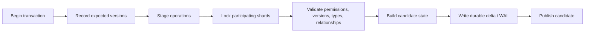

# 事务、持久化与恢复

Ousject 的核心提交约束是：候选修改必须先完整验证并持久化，之后才能对读取者可见。持久化
失败的修改不得以已提交状态留在内存中。

## 提交流程



事务可以包含：

- 创建 Object；
- 替换状态；
- 设置或删除 Link；
- Reparent；
- Grant 或 Revoke；
- Tombstone。

每个被修改的既有 Object 都需要 expected version。版本不匹配、权限不足、类型错误、Parent
环或持久化错误都会使整次提交失败。

## 跨 Shard 原子性

事务根据 Object ID 的稳定路由确定参与 Shard，并按稳定的全局顺序获取读写锁。操作先应用
到候选状态并做全局关系校验；只有整个候选有效时才进入持久化阶段。

持久成功后，各 Shard 才发布新状态。因此读取者看到的是提交前或提交后的完整状态，不会
看到一半 Object 已更新、另一半尚未更新的中间结果。

`Reparent` 与退役目前会保守地锁定全部 Shard，以保证全局关系检查没有竞态。这是正确性
优先的当前实现，不代表最终性能形态。

## WAL 与 Checkpoint

`FileSnapshotBackend` 维护带校验的持久格式：

- `OMS0`：Checkpoint snapshot；
- `OMW0`：增量 WAL；
- `OMG0`：活动 generation manifest。

提交优先写入增量 after-image。写入成功并同步后，内存状态才发布。多个接近的提交可进入
Group Commit；当前批次上限为 64 条记录或 1 MiB。

WAL 达到阈值后会调度后台 Checkpoint。默认空 Store 阈值为 64 MiB；已有 Checkpoint 时，
实现也会根据现有 snapshot 大小选择更早的阈值。Checkpoint 使用 generation 切换，确保
崩溃恢复可以选择完整的旧代或新代。

这些数字属于当前实现参数，不是公开格式承诺。

## 恢复

打开持久 Store 时，OMS：

1. 获取 Store lease，拒绝同时写入；
2. 读取 manifest 与候选 generation；
3. 校验 Checkpoint 和 WAL 记录；
4. 从 Checkpoint 开始按顺序应用完整 delta；
5. 校验 Parent graph、Type index 和动态 Type；
6. 使用配置的稳定路由重新分配到 Shard；
7. 最后才向调用者返回可用 Store。

损坏数据不会被当成空 Store 静默启动。WAL 尾部撕裂、manifest 损坏、generation 切换两侧
和同步失败都有对应测试。

Store lease 会阻止两个活动进程同时打开同一路径，并能识别和回收已死亡进程遗留的锁。

## Process 一致性

Program 和 Process 都是 Object。Process 状态包含 Subject、Token position、栈、变量、
调用帧、异常处理状态、运行状态、等待原因和 Worker lease。

VM 把一个执行片产生的 Object 修改与 Process 前进合并到 OMS 提交中。若提交失败，既不会
只保留业务对象修改，也不会只推进 Token 位置。重启后调度器根据持久 Process 状态恢复
Ready、Waiting 或 Sleeping Process。

这不表示每条 Token 都强制单独 `fsync`；VM 可以在不跨越事务、等待、Provider Effect 等
语义边界的前提下批量推进执行片。

## 外部 Effect

网络发送、Terminal 输出和设备操作不能像内存修改一样回滚。VM 因此在执行外部动作前创建
持久 Effect intent：

```text
persist intent → invoke Provider → persist outcome
```

Provider 声明恢复策略：

- `retry_idempotent`：重启后可用相同 Effect identity 安全重试；
- `manual`：结果不确定时保留 `unknown`，由受信任操作显式处理。

Pending Effect 的轮询会复用原来的 Effect identity；重复的 Pending 响应不会不断创建相同的
`effect.running` / `effect.pending` 审计对象。

这样可以避免把“进程崩溃”误当成“外部动作肯定没有发生”。不同 Provider 能提供的
exactly-once 保证取决于外部系统是否识别 Effect identity。

## Timer、Channel 与 SwapPool

- Timer 的 deadline 和 Process wait reason 持久化；重启后可重新构建等待状态。
- `child.wait()` 会将父 Process 持久化为 `Waiting(Process(child))`，释放父 Process 的
  Worker lease；子 Process 结束后，调度器通过持久 waiter Link 唤醒父 Process。
- Channel 的消息、消费和等待唤醒通过 OMS 事务提交。
- SwapPool 共享 Object identity 和提交后的 Object state，不暴露 RAM 地址。

这些对象遵循与普通 Object 相同的版本、权限和恢复规则，但各自有领域限制。

## 退役与回收

退役把 Object 变为 Tombstone，而不是立刻复用 ID。当前保留期是 7 天。后台 reaper 到期后
回收内容；若存在未解决 Effect 等安全阻碍，则拒绝不安全压缩并稍后重试。

可以通过 dry-run 分析回收影响；Compaction 必须保持活跃 Object 的身份与状态。

## 已验证的故障边界

测试覆盖：

- 并发写入冲突；
- 跨 Shard 原子提交；
- 持久化失败不可见；
- Group Commit 共同发布；
- Checkpoint 前后恢复；
- WAL 与 manifest 位损坏；
- Store 独占与死进程 lease；
- Process、Channel、Timer 和 Effect 重启恢复。

测试位置见[构建与测试](../getting-started/build-and-test.md)。持久格式仍为版本 0，当前保证
面向同一实现的故障恢复，不等于未来版本间的格式兼容。
